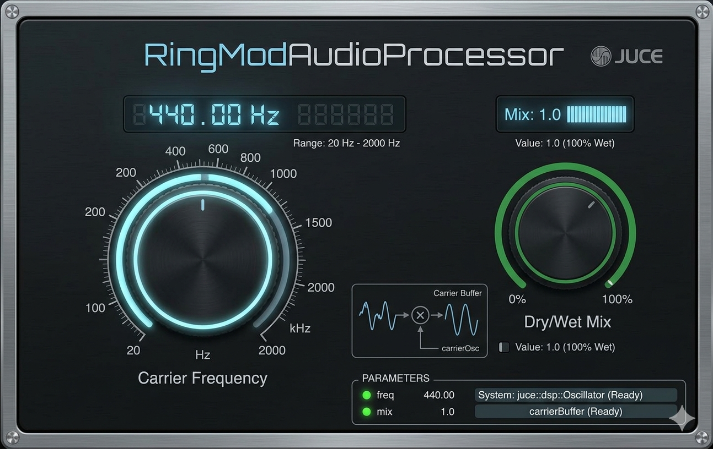

# RingMod

[](https://github.com/kv244/RingModulator/actions/workflows/compile.yml)
[](https://github.com/kv244/RingModulator/actions/workflows/lint.yml)

A ring modulator audio plugin built with [JUCE](https://juce.com/). Multiplies the input signal by a sine-wave carrier to produce classic ring modulation sidebands, with a dry/wet mix control.



## Parameters

| Parameter | Range | Default | Description |
|---|---|---|---|
| Carrier Frequency | 20 – 2000 Hz | 440 Hz | Frequency of the internal sine oscillator (log-scaled) |
| Dry/Wet Mix | 0 – 1 | 1.0 | 0 = dry input only, 1 = fully ring-modulated output |

## How It Works

Ring modulation multiplies the input signal by a carrier sine wave:

```
output = dry + mix * (input × carrier − dry)
```

This creates sum and difference sidebands around the carrier frequency, producing metallic, bell-like, or robotic timbres depending on the carrier frequency and input material.

## Building

### Requirements

- CMake 3.22+
- A C++17 compiler (MSVC 2022, Clang, or GCC)
- Git (JUCE 8.0.13 is fetched automatically if no local copy is provided)

### Configure and Build

```bash
# JUCE is downloaded automatically via FetchContent
cmake -B build
cmake --build build --config Release
```

To use a local JUCE tree instead (faster, avoids the download):

```bash
cmake -B build -DJUCE_PATH="/path/to/JUCE"
cmake --build build --config Release
```

The built plugin will be placed in `build/RingMod_artefacts/Release/`.

Supported formats: **VST3**, **Standalone**.

### Installing into a DAW

Copy `build/RingMod_artefacts/Release/VST3/RingMod.vst3` to:

| OS | Default VST3 folder |
|---|---|
| Windows | `C:\Program Files\Common Files\VST3\` |
| macOS | `/Library/Audio/Plug-Ins/VST3/` |

**Auto-install after build** (Windows, requires admin shell):

```bash
cmake -B build -DJUCE_PATH="..." -DCOPY_PLUGIN=ON
cmake --build build --config Release
```

#### Ableton Live
Preferences → Plug-Ins → enable "Use VST3 Plug-In Custom Folder" or point it at the Common Files path above. Re-scan plug-ins after copying.

#### Renoise
Preferences → Plug-Ins/Devices → add the VST3 folder and click Re-scan. The plugin supports both mono and stereo FX tracks.

## Project Structure

```
ringmod/
├── CMakeLists.txt
├── README.md
├── LICENSE
├── assets/
│   └── icon.svg
└── source/
    ├── PluginProcessor.h / .cpp   # DSP: oscillator, ring mod, state save/load
    ├── PluginEditor.h / .cpp      # GUI: custom knobs, oscilloscope, LED bar
    └── GUI.png                    # Reference design
```

## License

MIT — see [LICENSE](LICENSE).
